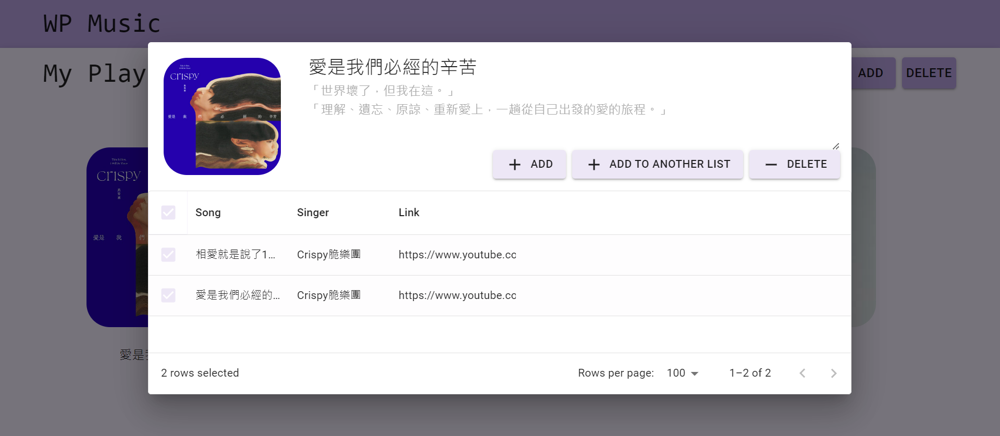
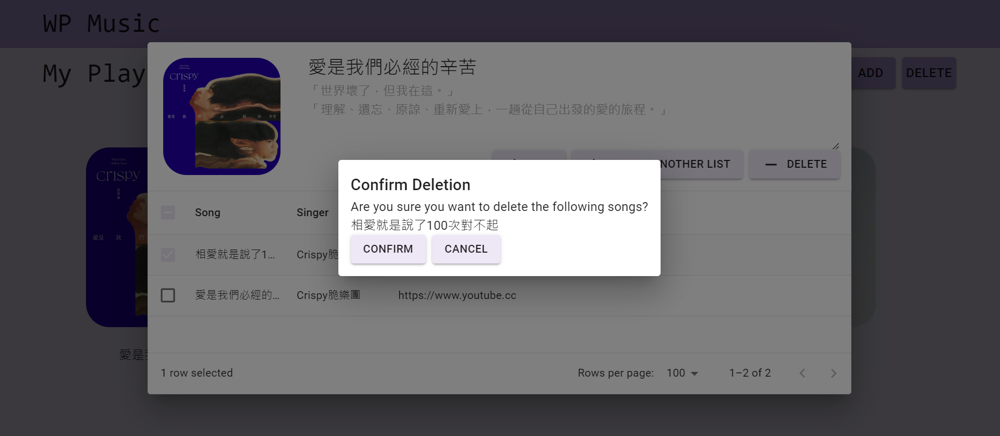

# HW#2: WP Music

## Project Overview

1. **首頁**，可以容納所有播放清單的頁面，包含以下元素：
	1. **標題：** WP Music 顯示於頁面上方的位置，My Playlists 顯示於其下。
	2. **播放清單：**
		1. 以網格 (grid) 方式將所有資料庫中的播放清單呈現在首頁。
		2. 支援響應式設計 (RWD)，即每列之播放清單數量會根據螢幕大小進行調整
    		   
		   

		4. 各個清單之**歌曲數量、清單名稱以及清單圖片**
		5. 點擊清單圖片後即可瀏覽其**內容**。
	3. **「ADD」按鈕：**
	  - 點擊後跳出彈窗，供使用者輸入清單名稱及清單敘述。完成輸入後，可馬上在首頁看到新的播放清單，並同時將清單資料新增至資料庫。
	  - **使用者提示**：當使用者未輸入資訊或是進行錯誤操作時，給予適當提示。
            

	  - **重複名稱檢測**：新增播放清單時，會檢查資料庫，確定名稱不重複。
            

	  -  **自編播放清單圖片**：播放清單圖片可自定義，並存到資料庫，且可從資料庫讀取正確圖片。
          

	4. **「DELETE」按鈕：**
		1. 點擊該按鈕後，進入刪除模式 。按鈕上文字變為「DONE」。
		2. 刪除模式：每個播放清單的右上角會出現刪除按鈕，點擊該播放清單之刪除按鈕後該播放清單即被刪除。
		3. 再次點擊「DONE」按鈕後，清單右上角之刪除按鈕消失。按鈕上文字變回「DELETE」。
     	   

	5. **搜尋**
		1. 搜尋功能，透過輸入關鍵字尋找相對應之清單。
     	        


	

2. **播放清單頁，** 包含以下功能：
	1. **播放清單資訊：**可瀏覽播放清單之**圖片、標題、敘述**，且**標題、敘述皆可編輯(按 enter 後才會儲存)**。
	2. **歌曲資訊：**
		1. 在每個 row 最前方有一個 checkbox 可供選取。而表頭之 checkbox 具全選功能。
                   

		2. 可以清楚看到**歌曲之標題、歌手、連結，且皆可編輯**(點擊該格兩下即可編輯，若是要編輯連結需點擊連結旁邊的空白)。
     			

		3. 可將歌曲新增至其他清單（仍保留於原播放清單）
    			

	3. **支援響應式設計 (RWD)：** 文字以及歌曲列表之寬度須根據螢幕大小進行調整
           

	4. **「ADD」按鈕：**
		- 點擊後跳出彈窗，供使用者輸入歌曲名稱、歌手以及連結。完成輸入後，可馬上在頁面看到新的歌曲並同時將歌曲資料新增至資料庫。
		  

		- **使用者提示**：當使用者未輸入資訊或是進行錯誤操作時，給予適當提示。
		  

		- **重複名稱檢測**：新增歌曲時，會檢查資料庫，確定名稱不重複。
                  

	5. **「DELETE」按鈕：**
		1. 點擊後跳出彈窗，將所有被勾選的歌曲資訊列出。並詢問使用者「是否確定刪除」。若使用者選擇「確定刪除」則刪除所有已選取之歌曲。
  			

		2. 若無歌曲被勾選則提示「請勾選歌曲」。
     			

	6. **連結：** 可供使用者點擊，並以新分頁開啟該連結
   

## 有完成的進階要求
1. **使用者提示**：當使用者未輸入資訊或是進行錯誤操作時，給予適當提示。例如使用者新增或編輯清單時，未輸入標題，以彈窗提示「請輸入標題」。
2. **重複名稱檢測**：新增播放清單、歌曲時，需檢查資料庫，確定名稱不可重複。
3. **搜尋**：在**首頁**實作搜尋功能，透過輸入關鍵字尋找相對應之清單。
4. **自編播放清單圖片**：播放清單圖片可自定義，並存到資料庫，且可從資料庫讀取正確圖片。

## Run the app

Follow the instructions in this section to run the app locally.

### 1. backend setup

Start by copying the `.env.example` file to `.env`.

```bash
cd backend
cp .env.example .env
```

Then, fill in the `MONGO_URL` field in `.env` with your MongoDB connection string and fill in the `PORT` field with the port you want to use. After that, you're `.env` file should look like this. If you don't want to use MongoDB Atlas, you can also run a local MongoDB server with Docker. You can find the instructions [here](https://hub.docker.com/_/mongo).

```bash
PORT=8000
MONGO_URL="mongodb+srv://<username>:<password>@<cluster>.example.mongodb.net/?retryWrites=true&w=majority"
```
**若 port 有更改為非 8000 的數字則前端 .env 中的 port number 也須隨之更改。**

Install dependencies

```bash
yarn
```

### 2. frontend setup 

Start by copying the `.env.example` file to `.env`.

```bash
cd frontend
cp .env.example .env
```

Then, fill in the `VITE_API_URL` field in `.env` with the url of your backend server. After that, you're `.env` file should look like this. Note that the port should be the same as the one you set in the backend `.env` file.

```bash
VITE_API_URL="http://localhost:8000/api"
```

Install dependencies

```bash
yarn 
```

### 3. start the backend server

```bash
cd backend
yarn dev
```

### 4. start the frontend server

```bash
cd frontend
yarn dev
```

Visit `http://localhost:5173` to see the app in action. 


